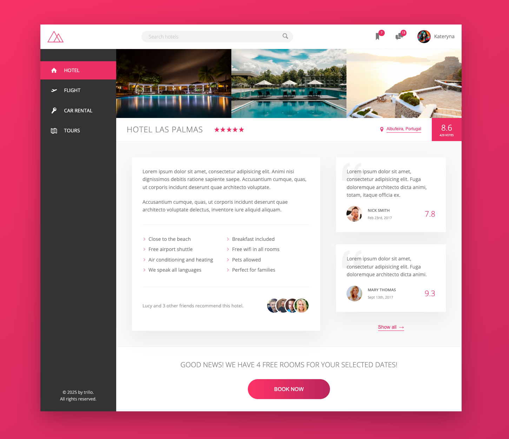

<!--
анимация для навигации
 https://www.udemy.com/course/advanced-css-and-sass/learn/lecture/8274600#notes -->

<!-- анимация пульсирующая кнопка
https://www.udemy.com/course/advanced-css-and-sass/learn/lecture/8274606#notes -->

<!-- маска - способ для измениния цвета в css для svg
https://www.udemy.com/course/advanced-css-and-sass/learn/lecture/8274610#overview -->

# Trillo - All-in-One Booking App (UI)

## Description

**Trillo** is a fictional all-in-one booking app designed for users to book hotels, flights, cars, and tours on a single platform. This project focuses solely on coding the **user interface** without any backend functionality.

The UI is structured as follows:

- A **navigation bar** that allows users to browse different sections.
- A **hotel overview** section displaying images, hotel name, star rating, and key features.
- A **reviews section** with user feedback.
- A **booking section** with an interactive hover effect on the button.
- A **header bar** featuring a logo, a search bar, bookmarks, chat, and the user profile.

## Features

- Modern and responsive **Flexbox-based layout**.
- Beautiful **hover effects** for an interactive experience.
- SVG icons integration for a clean and scalable UI.
- Smooth **CSS animations** to enhance user interactions.
- A **structured and visually appealing design** to inspire future projects.

## Technologies Used

- **HTML5** for structured content.
- **CSS3** with a focus on **Flexbox** for layout.
- **SVG icons** for scalable and high-quality graphics.
- **CSS animations and transitions** for smooth interactions.

This project is a great opportunity to **learn and practice Flexbox**, explore advanced **CSS techniques**, and build a modern, professional-looking web interface.

---

The project was created as part of learning CSS Flexbox model and responsive web design.
